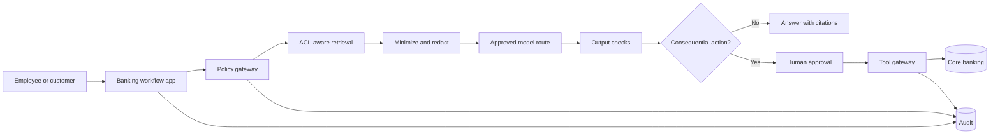

# Banking Reference Architecture

Source anchors: [European Commission AI Act overview](https://digital-strategy.ec.europa.eu/en/policies/regulatory-framework-ai), [GDPR Article 5](https://gdpr-info.eu/art-5-gdpr/), [OWASP LLM Top 10](https://owasp.org/www-project-top-10-for-large-language-model-applications/), [NIST AI RMF](https://www.nist.gov/itl/ai-risk-management-framework).

## Control plane

The control plane owns policy, identity, approvals, and audit.

Components:

- Identity provider with MFA and role/group claims.
- Policy decision point for role, purpose, tenant, data class, action, and risk.
- Tool registry with side-effect classifications.
- Approval service for high-risk operations.
- Audit event store with redacted payloads.
- Evaluation registry and release gate.

## Data plane

The data plane owns customer data movement.

Components:

- Source systems: CRM, core banking, cards, fraud, KYC, complaints.
- Data minimization service.
- PII/token redaction service.
- ACL-aware retrieval service.
- Model gateway with prompt templates and output filters.
- Post-processing and schema validation.

## Runtime flow

1. User authenticates.
2. Application creates a task with purpose, customer/account scope, and requested action.
3. Policy gateway checks role and purpose.
4. Retrieval service fetches only authorized fields/chunks.
5. Redaction service removes or tokenizes restricted values.
6. Agent receives trusted instructions plus minimized context.
7. Agent proposes answer or tool call.
8. Tool gateway validates tool call deterministically.
9. Human approval is required for consequential actions.
10. Output is validated, redacted, cited, and logged.

## Recommended isolation

- Separate production agents from experimental agents.
- Separate read-only analysis agents from action-taking agents.
- Separate untrusted-content summarizers from privileged action planners.
- Use per-environment model/API keys and workload identities.
- Use network egress restrictions for tools.

## Example policies

- A teller can summarize a customer's recent transactions only for an authenticated in-branch service case.
- A fraud analyst can retrieve fraud alerts and transaction metadata but cannot initiate customer notifications without approval.
- A support agent can draft a message, but a human must approve messages involving fees, disputes, fraud, or account restrictions.
- No agent can export more than a small bounded number of customer records without a separate export workflow.
