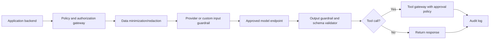

# Cloud and Provider Guardrails

Provider guardrails are useful, but they are not a substitute for application security. Put them behind a server-side policy gateway and treat them as one layer in a defense-in-depth system.

## What provider guardrails can help with

| Capability | Examples | Use it for | Do not use it as |
| --- | --- | --- | --- |
| Content filters | AWS Bedrock Guardrails content filters, OpenAI moderation, Azure Content Safety | Harmful content, abuse, policy violations | Authorization or legal approval |
| Prompt-injection detection | Azure Prompt Shields, Bedrock prompt attack filters | Detection and blocking of common direct/indirect attacks | A complete prompt-injection fix |
| Sensitive information filters | Bedrock sensitive information filters, custom regex/NER, application redaction | PII masking/blocking in prompts and responses | A reason to send unnecessary data |
| Grounding checks | Bedrock contextual grounding, Azure/RAG evaluators | Hallucination detection and RAG QA | Proof that an answer is legally correct |
| Evaluation/observability | OpenAI evals, Microsoft Foundry observability, custom eval runners | CI gates, release checks, monitoring | One-time certification |

## AWS Bedrock Guardrails

AWS documents configurable safeguards for generative AI applications, including content filters, denied topics, word filters, sensitive information filters, contextual grounding checks, and automated reasoning checks: [AWS Bedrock Guardrails](https://docs.aws.amazon.com/bedrock/latest/userguide/guardrails.html).

Practical use:

- Configure PII masking/blocking for customer-service workflows.
- Use denied topics for illegal financial advice or unsupported regulated claims.
- Use contextual grounding checks for RAG answers.
- Test guardrail versions before promoting them.
- Use `ApplyGuardrail` outside model invocation when you need pre-checks or post-checks.

Limitations:

- Guardrails cannot decide whether a bank employee is allowed to access a specific customer's record.
- Guardrails do not replace row-level security, tool policy, approval workflows, or audit logging.
- Prompt injection in logs, documents, and tool outputs still needs architectural isolation.

## Azure AI Content Safety and Foundry

Azure Prompt Shields detects and blocks adversarial inputs and document attacks against LLM applications: [Azure Prompt Shields](https://learn.microsoft.com/en-us/azure/ai-services/content-safety/concepts/jailbreak-detection). Microsoft describes user prompt attacks and document attacks, including attempts to change system rules, exfiltrate data, block capabilities, commit fraud, or trigger malware behavior.

Microsoft Foundry observability describes evaluation, monitoring, and tracing for generative AI systems, including built-in evaluators for quality, RAG groundedness/relevance, safety, protected materials, tool-call accuracy, and task completion: [Microsoft Foundry observability](https://learn.microsoft.com/en-us/azure/ai-foundry/concepts/evaluation-approach-gen-ai).

Practical use:

- Run Prompt Shields on user prompts and uploaded/retrieved documents.
- Add RAG groundedness and relevance evaluators to CI.
- Trace tool calls and agent steps.
- Alert on harmful content, quality threshold failures, latency, token spikes, and error rates.

Limitations:

- Azure's own docs state that false positives/negatives can happen and recommend additional validation layers.
- A prompt shield cannot grant business authorization.
- Observability tells you what happened; it does not automatically make the architecture safe.

## OpenAI platform controls

OpenAI recommends moderation, adversarial testing, human review in high-stakes domains, constrained input/output, issue reporting, limitations disclosure, safety identifiers, and API key revocation: [OpenAI safety best practices](https://platform.openai.com/docs/guides/safety-best-practices). OpenAI evals support systematic testing of model/application behavior: [OpenAI evals](https://platform.openai.com/docs/guides/evals).

Practical use:

- Add moderation/safety checks around model calls.
- Use stable privacy-preserving safety identifiers.
- Red-team prompt injection and policy bypasses before release.
- Build evals for every incident and major policy control.

Limitations:

- Moderation does not replace data minimization.
- Prompt instructions do not enforce authorization.
- Human oversight must be an actual workflow, not a sentence in a prompt.

## Anthropic guardrail guidance

Anthropic documents mitigations for jailbreaks and prompt injection: [Anthropic jailbreak mitigation](https://docs.anthropic.com/en/docs/test-and-evaluate/strengthen-guardrails/mitigate-jailbreaks). Use this as another source for layered defenses, adversarial testing, and strengthening application-level controls.

## Recommended cloud architecture

## Provider selection checklist

- Is the provider approved for the data class?
- Is the region approved for EU personal data?
- Is training on inputs disabled or contractually controlled?
- What is prompt/trace retention?
- Are subprocessors documented?
- Are audit logs exportable?
- Are content safety, prompt-injection, PII, and grounding checks available?
- Can the organization run custom evals and regression tests?
- Can a model route be disabled quickly?
