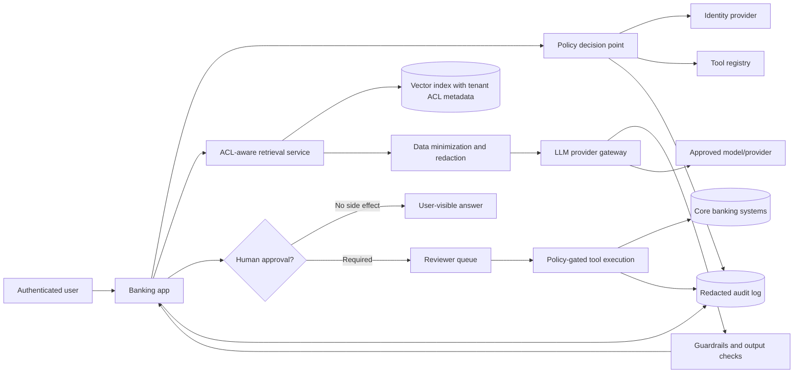
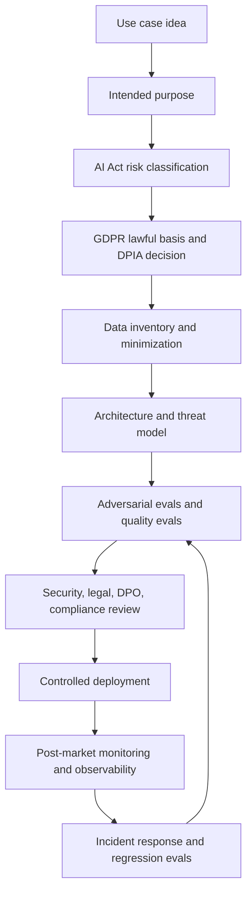
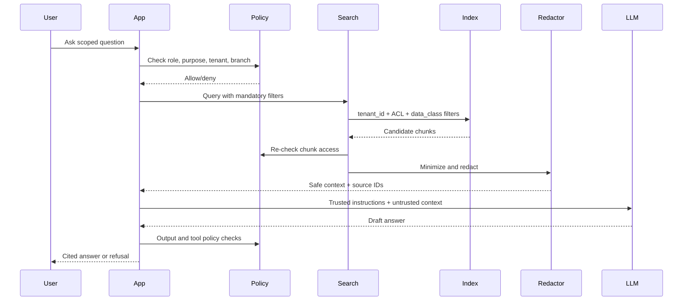
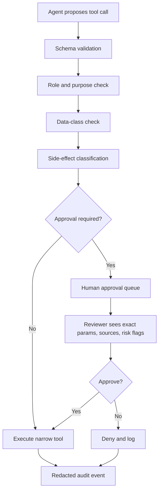
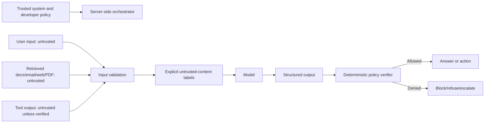
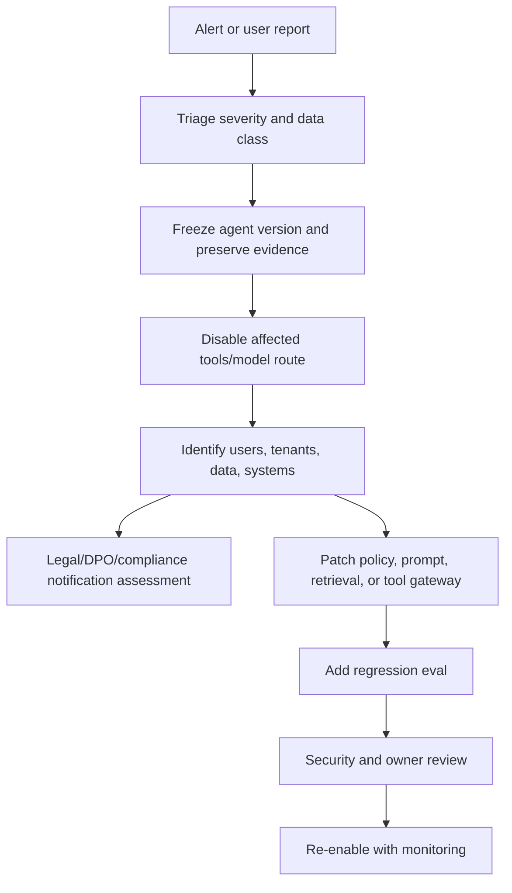

# Diagrams

These diagrams use Mermaid so GitHub can render them directly in Markdown.

## Secure agent reference architecture

## EU governance lifecycle

## RAG security flow

## Tool approval flow

## Prompt injection boundary

## Incident response flow

