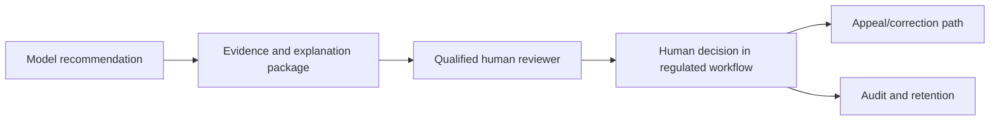
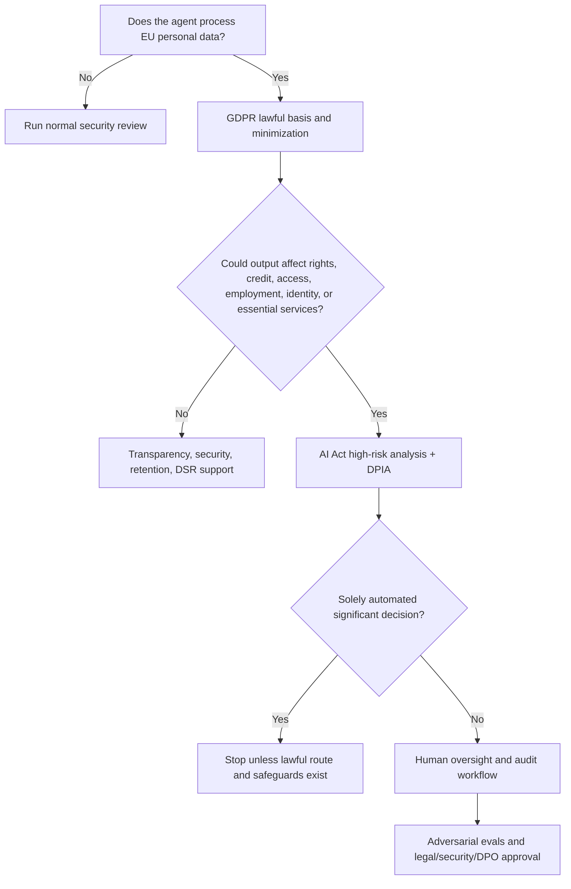

# EU Regulatory Map for AI Agents

This document expands the EU-focused review path. It is written for regulated use cases such as banking, insurance, financial advice, fraud, AML, customer support, credit, identity, and employee workflows.

## Primary EU sources

- [European Commission AI Act overview](https://digital-strategy.ec.europa.eu/en/policies/regulatory-framework-ai)
- [EU AI Act, Regulation (EU) 2024/1689](https://eur-lex.europa.eu/eli/reg/2024/1689/oj)
- [GDPR Article 5: processing principles](https://gdpr-info.eu/art-5-gdpr/)
- [GDPR Article 22: automated decision-making and profiling](https://gdpr-info.eu/art-22-gdpr/)
- [EDPB Opinion 28/2024 on AI models and personal data](https://www.edpb.europa.eu/our-work-tools/our-documents/opinion-board-art-64/opinion-282024-certain-data-protection-aspects_en)
- [NIS2 Directive](https://eur-lex.europa.eu/eli/dir/2022/2555/oj)
- [Digital Operational Resilience Act, DORA](https://eur-lex.europa.eu/eli/reg/2022/2554/oj)
- [Data Governance Act](https://eur-lex.europa.eu/eli/reg/2022/868/oj)
- [Data Act](https://eur-lex.europa.eu/eli/reg/2023/2854/oj)

## AI Act timeline anchors

As of June 2026, the European Commission explains that:

- The AI Act entered into force on 1 August 2024.
- Prohibited AI practices and AI literacy obligations applied from 2 February 2025.
- Governance rules and GPAI model obligations applied from 2 August 2025.
- Transparency rules apply from August 2026.
- Some high-risk AI rules have phased timelines, including 2 December 2027 for certain high-risk areas and 2 August 2028 for product-integrated systems, according to the Commission's implementation update.

Engineering implication: keep a `regulatory_version` and `policy_version` in the agent registry because timelines and implementation guidance can change.

## Risk classification map

| Use case | Likely review level | Why |
| --- | --- | --- |
| FAQ chatbot with public information | Limited/transparency review | Users may need to know they interact with AI. |
| Customer support summarizer using account data | GDPR/security review | Personal and financial data are processed. |
| Fraud case summarizer | High internal risk; possible sector review | Can affect customer treatment and suspicious activity workflows. |
| Credit eligibility, credit scoring, affordability | AI Act high-risk candidate | Access to essential private services such as credit is explicitly called out by the Commission. |
| Employee monitoring, ranking, hiring, promotion | AI Act high-risk candidate | Employment and worker-management uses are listed high-risk areas. |
| Autonomous account freezing, payment blocking, or money movement | Prohibit autonomous operation internally | Consequential customer impact requires deterministic policy and human approval. |

## Required artifacts for EU review

- Intended purpose statement.
- Operator role assessment: provider, deployer, importer, distributor, or product manufacturer.
- AI Act risk classification.
- GDPR lawful basis.
- DPIA decision and DPIA when required.
- Fundamental rights impact assessment where required or prudent.
- Data inventory and records of processing.
- Technical documentation.
- Human oversight design.
- Logging and traceability design.
- Post-market monitoring plan.
- Incident and serious-incident workflow.

## Data protection controls

GDPR Article 5 principles translate directly into engineering controls:

| GDPR principle | Engineering control |
| --- | --- |
| Lawfulness, fairness, transparency | Lawful-basis record, user notice, AI disclosure where required. |
| Purpose limitation | Every agent request carries `purpose`, `case_id`, and `actor_id`. |
| Data minimization | Prompt schemas include only required fields. |
| Accuracy | Source citations, reviewer access to original records, correction workflow. |
| Storage limitation | Retention schedule for prompts, traces, embeddings, audit logs. |
| Integrity and confidentiality | Encryption, RBAC/ABAC, network isolation, redaction, monitoring. |
| Accountability | Evidence matrix, approval records, audit exports. |

## Automated decision-making

GDPR Article 22 requires special attention when outputs create legal or similarly significant effects. In banking, treat these as high-risk even when the model is only "recommending":

- Credit approval/denial.
- Fraud account restrictions.
- Pricing or fee decisions with customer impact.
- Debt collection prioritization.
- KYC or AML escalation with adverse consequences.

Required engineering pattern:

## EU banking overlay

For banks and financial institutions, AI governance interacts with operational resilience and outsourcing:

- DORA requires strong ICT risk management and third-party risk controls for financial entities.
- NIS2 may apply depending on entity and service scope.
- Cloud/model providers should be reviewed like critical ICT third-party dependencies when they support important functions.
- Outsourcing and third-party risk reviews should cover model provider region, retention, subprocessors, incident reporting, exit plan, and auditability.

## Practical release decision tree

